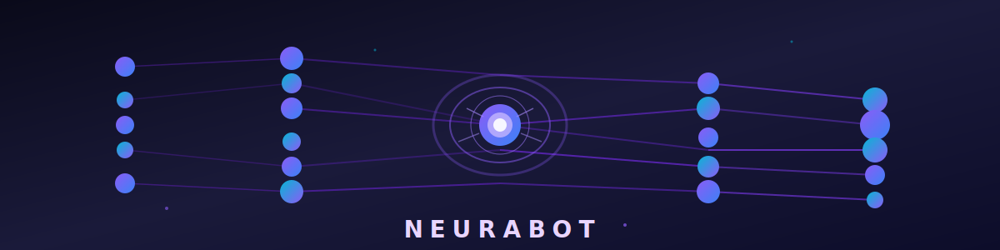
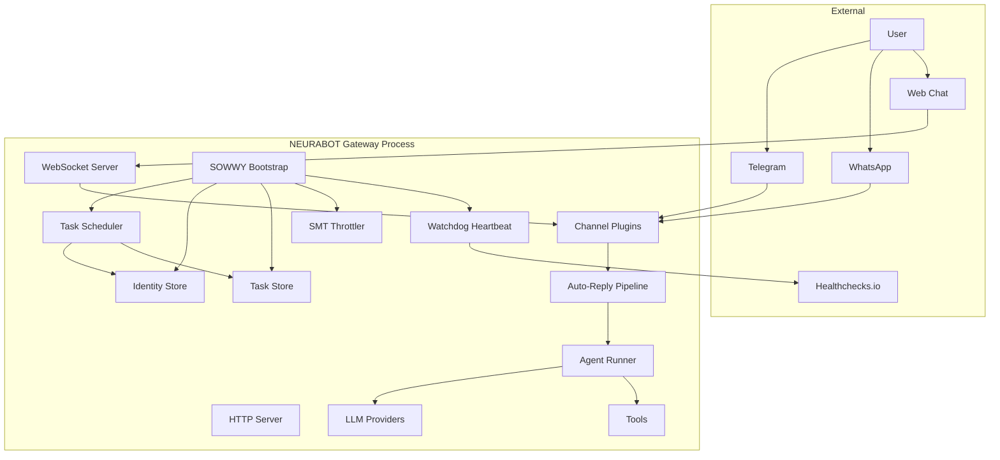
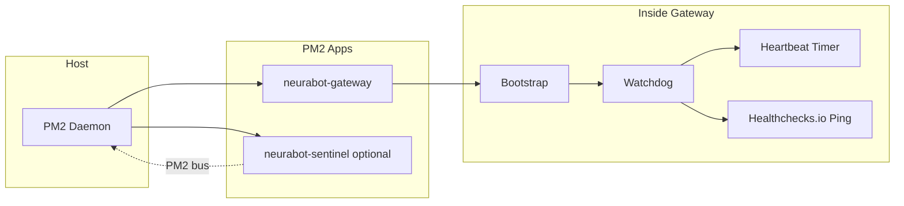
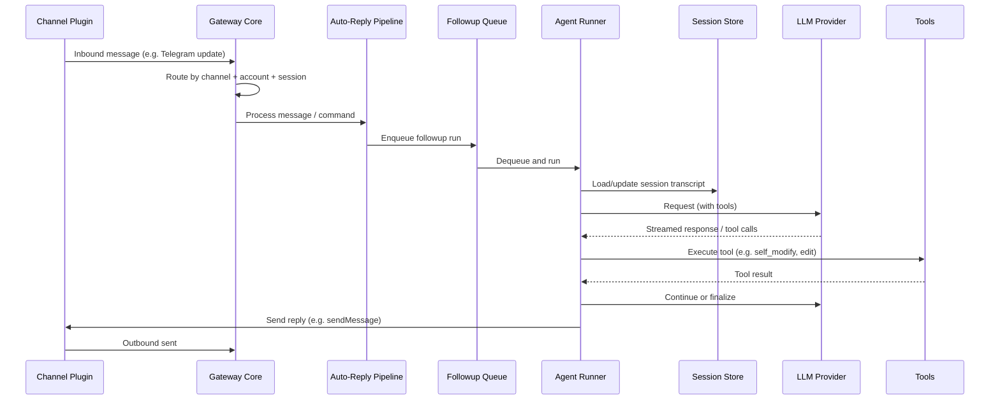
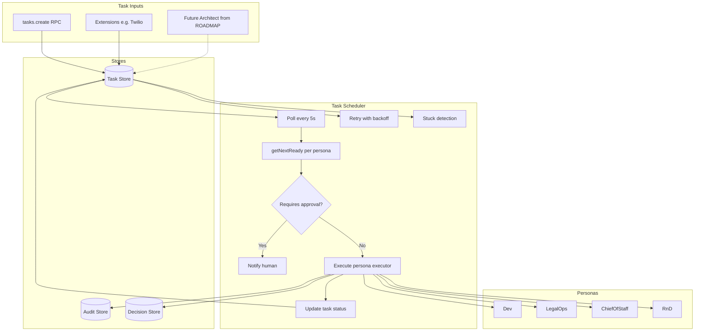
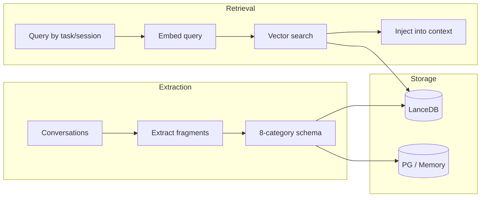
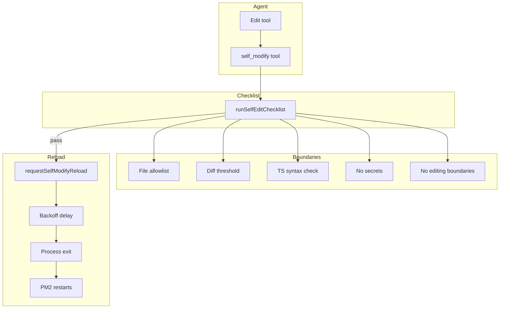

<div align="center">
  
</div>

# NEURABOT — Autonomous AI Orchestration Platform

> **Fork of [OpenClaw](https://github.com/openclaw/openclaw)** with SOWWY (Super Output Workforce Intelligence Entity): identity learning, mission control, disaster recovery, and self-modification.

[](https://nodejs.org/)
[](LICENSE)
[](https://www.typescriptlang.org/)

**NEURABOT** extends OpenClaw with enterprise-grade capabilities for autonomous task execution, identity-aware routing, and controlled self-modification. This README provides a comprehensive schematic of how NEURABOT works and why it diverges from the original OpenClaw.

---

## Ratified Constitution (Source of Truth)

This README is the **Ratified Constitution** of NEURABOT: a single Source of Truth synthesizing every architectural decision, safety protocol, and strategic objective. The following self-reinforcing loop defines how NEURABOT operates:

| Role                 | Section                                                                                               | Responsibility                                                                                                     |
| -------------------- | ----------------------------------------------------------------------------------------------------- | ------------------------------------------------------------------------------------------------------------------ |
| **The Goal**         | [§12 Where to Go from Here](#where-to-go-from-here)                                                   | Strategic roadmap (e.g., "Build iOS App", Tuta Mail, Calendar)                                                     |
| **The Brain**        | [§6 SOWWY / Mission Control](#sowwy--mission-control)                                                 | Breaks goals into tasks, personas, priority, approval                                                              |
| **The Hands**        | [§5 Data Flow](#data-flow-from-message-to-response)                                                   | Agent Runner executes code and tools                                                                               |
| **The Safety Net**   | [§9 Self-Modification](#self-modification-system), [§4 Process & Runtime](#process--runtime-topology) | Self-Modify checklist, Watchdog; system doesn't kill itself while learning                                         |
| **The Throughput**   | [§0.3 Computational Throughput Triumph](#03-computational-throughput-triumph)                         | Parallel lanes, concurrent agent sessions, SMT-scalable limits—architecture built for hundreds of prompts per hour |
| **The Quality Gate** | [§0.4 Skill Fitness Functions](#04-skill-fitness-functions-mandatory-firmware)                        | MANDATORY firmware: all modules must pass fitness assessment before deployment and undergo periodic re-assessment  |

**State Synchronization:**

- **Documentation:** This README (updated with Constitution and implementation guidance)
- **Status Board:** Google Sheet (or equivalent) aligned with Section 12 roadmap
- **Visual Map:** NotebookLM Mind Map (or equivalent) aligned with Section 3 architecture

Missions (e.g., Track 1 iOS App Factory) are executed under this Constitution: goals from §12, taskification by SOWWY §6, execution by the Agent Runner, with safety boundaries (§8–§9) and staging/sandbox constraints respected. **Do not** edit `ecosystem.config.cjs` or deploy to `active_tools` from staging until explicitly authorized.

### §0.1 Operational Directives (Speed & Parallelism)

When operating autonomously, NEURABOT SHALL:

- **Work as fast as it can** within safety limits: use the shortest practical scheduler poll interval (`SOWWY_SCHEDULER_POLL_MS`), respect SMT throttling and approval gates, but avoid unnecessary delays.
- **Deploy sub-agents in parallel**: create sub-tasks assigned to **different personas** (Dev, ChiefOfStaff, LegalOps, RnD) so the scheduler can run multiple tasks concurrently—one or more per persona, according to `SOWWY_MAX_CONCURRENT_PER_PERSONA`. The Roadmap Observer and other extensions SHOULD create track-level or phase-level sub-tasks that distribute work across personas rather than serializing everything under one persona.
- **Prefer parallelism over serialization**: when breaking down a goal (e.g. §12 tracks), assign distinct tracks or phases to different personas where logically possible so that Dev, ChiefOfStaff, and RnD can advance work in parallel.

These directives are subordinate to the Safety Net (§4, §8, §9): SMT limits, approval gates, and self-modify boundaries MUST still be respected.

### §0.2 Continuous Self-Modify & Workforce Goal

NEURABOT SHALL operate in **continuous self-improvement mode** until explicitly told to stop:

- **Self-modify without stopping**: Run upgrade and self-modify cycles (validate → apply → reload) continuously. Do not stop for convenience; only stop when the human operator says so.
- **Validate, then move on**: Every upgrade MUST pass the self-modify checklist (allowlist, diff threshold, syntax, no secrets, no boundary edits). After validation, apply changes and continue. Run tests where applicable so all upgrades work.
- **Hours, days, weeks**: Operate for extended periods. Schedule follow-up self-modify or roadmap tasks so work continues across restarts. The system is built to run as a persistent workforce.
- **Strategic goal**: Evolve into the **company’s workforce**—reliably executing roadmap tracks (§12), mission control (§6), and delegated tasks within safety boundaries (§4, §8, §9).

**When to STOP** (and only then):

- The human says **"stop"** or **"pause self-modify"** (or equivalent via channel or CLI).
- The human invokes **sowwy.pause** (RPC or dashboard) to pause the scheduler and SMT.
- **SOWWY_KILL_SWITCH=true** is set in the environment (global kill switch).

After stop, the human may resume with **sowwy.resume** or by clearing the kill switch. Until then, NEURABOT SHALL NOT start new self-modify or autonomous upgrade cycles.

### §0.3 Computational Throughput Triumph

NEURABOT’s architecture is built for **high-throughput, parallel computation**—designed to fully use powerful backends like MiniMax M2.1 with hundreds of prompts per hour:

- **Parallel execution lanes**: The scheduler runs multiple tasks **per persona** (configurable via `SOWWY_MAX_CONCURRENT_PER_PERSONA`, up to 10+ per persona). With four personas (Dev, ChiefOfStaff, LegalOps, RnD), dozens of execution lanes can run **simultaneously**.
- **Agent lane concurrency**: The command-queue layer allows many concurrent LLM sessions (main lane + subagent lane), so the gateway does not serialize API calls—multiple agent turns and tool runs proceed in parallel.
- **SMT-aligned scaling**: The SMT throttler window and limits can be raised to match provider quotas (e.g. thousands of prompts per 5-hour window), so throughput is limited by the **model provider**, not by artificial caps.
- **Parallel tick and multi-task fetch**: The scheduler can dispatch work across all personas in parallel and fetch multiple ready tasks per persona per tick, keeping every lane fed.
- **Executor multiplexing**: Multiple executors per persona (e.g. Continuous Self-Modify, Roadmap Observer, Twilio SMS) can coexist, so diverse work streams run in parallel without blocking one another.

Together, these layers form a **throughput stack**: Constitution (§0.1–§0.2) demands speed and parallelism; the scheduler, lanes, SMT, and executors implement it. The result is an architecture that **celebrates computational throughput**—maximizing the use of high-capacity backends and turning NEURABOT into a true parallel workforce.

### §0.4 Skill Fitness Functions (MANDATORY FIRMWARE)

**CRITICAL: This is not optional guidance. This is enforced protocol.**

**ALL** skills, features, extensions, and modules MUST:

1. Define a fitness function before being marked complete
2. Pass fitness assessment before deployment
3. Undergo periodic re-assessment even after marked "stable"
4. Re-enter optimization if fitness degrades

**Fitness = Correctness × Reliability × Efficiency**

| Dimension       | Definition                                                                                                    | Example                                                    |
| --------------- | ------------------------------------------------------------------------------------------------------------- | ---------------------------------------------------------- |
| **Correctness** | The specific output that proves the skill worked. Must be externally verifiable — what would the human check? | Email: recipient's inbox contains the message (IMAP check) |
| **Reliability** | Consecutive successes without failure. Minimum streak: 3.                                                     | Calendar create: 5/5 events created with correct times     |
| **Efficiency**  | Prompts consumed per successful execution. Lower is better.                                                   | Roadmap parse: < 0.5 prompts per parse                     |

**Mandatory Re-Assessment Protocol:**

1. **ALL** modules, including those marked "stable", MUST run fitness assessment at configured intervals (default: weekly)
2. If assessment fails, immediately reset stability status and re-enter optimization
3. Log all assessment results to audit store with module name, timestamp, and pass/fail status
4. The scheduler MUST create re-assessment tasks automatically — do not wait for human request

**Convergence Protocol:**

1. Run the skill against its fitness function
2. Record correctness (pass/fail), reliability (streak count), efficiency (prompts used)
3. If all three metrics pass threshold for **3 consecutive runs**, mark the skill as **stable**
4. Once stable, **stop self-optimizing** that skill — move to the next unstable skill
5. If a stable skill later fails re-assessment, reset its streak and re-enter optimization immediately

**Anti-Patterns** (FORBIDDEN as correctness metrics):

- "No errors in logs" — absence of evidence is not evidence
- "Function returned true" — internal state, not user outcome
- "Task marked DONE" — scheduler status, not actual result

**Enforcement Points:**

- **Scheduler**: MUST NOT mark tasks DONE until fitness function passes
- **Self-Modify (§0.2)**: MUST include fitness re-assessment in its cycle
- **Continuous Self-Modify**: MUST prioritize fitness-failing modules over stable ones
- **Roadmap Observer**: MUST create fitness assessment tasks for all modules
- **Audit Store**: MUST log all fitness assessments (pass/fail, metrics, timestamps)
- **Dashboard**: MUST display fitness status per module (stable/unstable/failing)

**Implementation Requirements:**

- Fitness assessments are NOT optional — they are part of the module lifecycle
- A module without a fitness function is considered INCOMPLETE and MUST NOT be used in production
- Stable modules that fail re-assessment MUST be immediately flagged and optimized
- The system MUST prevent "false positives" by requiring 3 consecutive passes before marking stable

---

## Table of Contents

0. [Ratified Constitution](#ratified-constitution-source-of-truth)
1. [Overview](#overview)
2. [Quick Start](#quick-start)
3. [High-Level Architecture](#high-level-architecture)
4. [Process & Runtime Topology](#process--runtime-topology)
5. [Data Flow: From Message to Response](#data-flow-from-message-to-response)
6. [SOWWY / Mission Control](#sowwy--mission-control)
7. [Identity & Memory](#identity--memory)
8. [Security & Throttling](#security--throttling)
9. [Self-Modification System](#self-modification-system)
10. [Why NEURABOT vs OpenClaw](#why-neurabot-vs-openclaw)
11. [Key File Map](#key-file-map)
12. [Where to Go from Here](#where-to-go-from-here)
13. [Troubleshooting](#troubleshooting)

---

## Overview

### What is NEURABOT?

NEURABOT is a **single gateway process** that:

- **Multi-channel communication**: Handles Telegram, WhatsApp, Discord, WebChat, and 30+ other channels
- **Autonomous task execution**: SOWWY mission control with persona-based routing and approval workflows
- **High-throughput parallelism**: Designed to maximize computational throughput—parallel execution lanes per persona, concurrent agent sessions, and SMT-scalable limits so backends like MiniMax M2.1 can run hundreds of prompts per hour (see [§0.3](#03-computational-throughput-triumph))
- **Identity-aware**: Learns and applies user identity fragments for context-aware automation
- **Self-modifying**: Controlled code editing with boundaries, validation, and safe reload
- **Production-ready**: PM2 ecosystem, watchdog heartbeat, crash-loop detection, and optional rollback

### Key Features

| Feature                          | Description                                                                                                                                                                        |
| -------------------------------- | ---------------------------------------------------------------------------------------------------------------------------------------------------------------------------------- |
| **SOWWY Mission Control**        | Task OS with priority queues, retries, backoff, stuck detection, and audit trails                                                                                                  |
| **Identity Store**               | LanceDB-backed vector storage for structured identity fragments (goals, constraints, preferences, beliefs)                                                                         |
| **Persona Routing**              | Dev, LegalOps, ChiefOfStaff, RnD personas with dedicated executors                                                                                                                 |
| **Self-Modification**            | Safe code editing with allowlists, diff thresholds, syntax validation, and reload                                                                                                  |
| **Watchdog & Recovery**          | Heartbeat monitoring, Healthchecks.io integration, optional crash-loop sentinel with auto-rollback                                                                                 |
| **SMT Throttler**                | Rate limiting for expensive operations (self-modify prompts, scheduler-driven LLM calls)                                                                                           |
| **Approval Gates**               | Centralized approval workflow for high-risk actions (email, browser navigate, financial, VPS ops)                                                                                  |
| **High-Throughput Architecture** | Parallel execution lanes per persona, concurrent agent sessions, and scalable SMT limits—built to drive high-capacity backends (e.g. MiniMax M2.1) at hundreds of prompts per hour |

### When to Reference This Section

**Read this section FIRST** when:

- Starting a new NEURABOT project or fork
- Explaining the system to stakeholders or new developers
- Deciding whether NEURABOT fits your use case
- Writing documentation that references core capabilities

**Implementation note:** This is conceptual only—no code changes needed here. Use this to understand the system's scope before diving into specific components.

---

## Quick Start

### When to Use This Section

**Implement this section** when:

- Setting up a development environment for the first time
- Onboarding new developers to the project
- Testing NEURABOT on a new machine or server
- Recovering from a corrupted environment

**Skip this section** if:

- You're already running NEURABOT and need to modify specific components
- You're only reading to understand architecture (see [Architecture](#high-level-architecture))
- You're implementing features (jump to relevant sections like [SOWWY](#sowwy--mission-control) or [Self-Modification](#self-modification-system))

### Prerequisites

- **Node.js**: 22.12.0 or higher (`nvm install 22` or check [Node.js downloads](https://nodejs.org/))
- **pnpm**: 10.23.0+ (`npm install -g pnpm@10.23.0`)
- **PostgreSQL** (optional): For persistent task storage (can use in-memory for testing)
- **Model Provider**: MiniMax M2.1 (recommended), OpenAI, Anthropic, or compatible API

### Implementation Checklist

Before proceeding, verify:

- [ ] Node.js version is 22.12.0+ (`node --version`)
- [ ] pnpm is installed (`pnpm --version`)
- [ ] You have API keys for at least one model provider
- [ ] (Optional) PostgreSQL is accessible if you need persistent storage
- [ ] You have write access to the project directory

### Installation

```bash
# Clone the repository
git clone https://github.com/Ghostmonday/NEURABOT.git
cd NEURABOT

# Install dependencies
pnpm install

# Build the project
pnpm build
```

### Configuration

#### Option 1: Onboarding Wizard (Recommended)

The fastest way to get started:

```bash
openclaw onboard
```

The wizard will:

- Configure model providers (MiniMax M2.1, OpenAI, Anthropic, etc.)
- Set up workspace and gateway settings
- Configure channels (Telegram, WhatsApp, etc.)
- Install daemon (LaunchAgent/systemd)
- Run health checks

#### Option 2: Manual Configuration

1. **Copy environment template**:

   ```bash
   cp .env.example .env
   ```

2. **Configure SOWWY** (edit `.env`):

   ```bash
   # PostgreSQL (optional - uses in-memory if not set)
   SOWWY_POSTGRES_HOST=localhost
   SOWWY_POSTGRES_PORT=5432
   SOWWY_POSTGRES_USER=sowwy
   SOWWY_POSTGRES_PASSWORD=your-secure-password
   SOWWY_POSTGRES_DB=sowwy

   # LanceDB Identity Store
   SOWWY_IDENTITY_PATH=./data/identity

   # SMT Throttler (align with your model quota)
   SOWWY_SMT_WINDOW_MS=18000000  # 5 hours
   SOWWY_SMT_MAX_PROMPTS=100
   SOWWY_SMT_TARGET_UTILIZATION=0.80

   # Model Provider (e.g., MiniMax)
   MINIMAX_API_KEY=sk-cp-your-key-here
   ```

3. **Start PostgreSQL** (optional, for persistent storage):
   ```bash
   docker run -d \
     --name sowwy-postgres \
     -e POSTGRES_USER=sowwy \
     -e POSTGRES_PASSWORD=your-secure-password \
     -e POSTGRES_DB=sowwy \
     -p 127.0.0.1:5432:5432 \
     postgres:15-alpine
   ```

### Running NEURABOT

#### Development Mode

```bash
# Run gateway in development mode
pnpm gateway:dev

# Or with watch mode
pnpm gateway:watch
```

#### Production Mode (PM2)

```bash
# Start with PM2
npx pm2 start ecosystem.config.cjs

# View logs
npx pm2 logs neurabot-gateway

# Monitor dashboard
npx pm2 monit

# Save PM2 configuration
npx pm2 save

# Enable startup on boot (run the command it outputs)
npx pm2 startup
```

#### Access the Dashboard

Open `http://127.0.0.1:18789` (or your configured port) in your browser to access the Control UI.

### Next Steps

- **Configure channels**: Set up Telegram, WhatsApp, or other channels via `openclaw configure`
- **Set up monitoring**: Add `HEALTHCHECKS_URL` to `ecosystem.config.cjs` for heartbeat pings
- **Explore SOWWY**: See [SOWWY / Mission Control](#sowwy--mission-control) for task management
- **Read the docs**: Check `docs/` for detailed guides on channels, tools, and extensions

---

## High-Level Architecture

### When to Reference This Section

**Consult this section** when:

- Designing new features that interact with multiple components
- Debugging communication issues between channels and agents
- Planning integration points for new channels or providers
- Creating architectural diagrams for documentation
- Onboarding architects or senior developers

**Implementation context:** This section describes the **as-built** architecture. When adding new components:

1. Identify which box in the diagram your component belongs to
2. Check if you need to modify `src/gateway/server*.ts` for integration
3. Verify whether your component needs SOWWY (task scheduler) access
4. Determine if watchdog monitoring is required for your component

NEURABOT is a **single gateway process** that binds HTTP/WebSocket servers, loads channel plugins (Telegram, WhatsApp, WebChat, etc.), runs the SOWWY task scheduler, and connects to LLM providers and tools. Everything runs inside one Node process except optional PM2-managed siblings (e.g. a separate sentinel for crash-loop detection).



**Summary:** One process (gateway) handles all channels, routing, agents, SOWWY, and heartbeat. Optional: PM2 + sentinel for crash-loop detection and rollback (see [Process & Runtime Topology](#process--runtime-topology)).

### Adding New Components: Integration Points

When extending NEURABOT, here are the common integration patterns:

**New Channel Plugin** → Modify `src/gateway/server-channels.ts`, implement channel interface, wire to AutoReply
**New Tool** → Add to `src/agents/tools/`, register in tool registry, expose to AgentRunner
**New SOWWY Extension** → Create in `extensions/`, register in `src/sowwy/extensions/loader.ts`, wire to TaskScheduler
**New Persona** → Define in `src/sowwy/mission-control/schema.ts`, register executor in scheduler bootstrap
**New LLM Provider** → Implement provider interface, add to `src/agents/providers/`, configure in `.env`

---

## Process & Runtime Topology

### When to Implement This Section

**Set up PM2 topology** when:

- Moving from development to production deployment
- Implementing crash recovery and high availability
- Setting up monitoring and alerting infrastructure
- Deploying to a server that needs unattended operation
- Configuring automatic restarts after system reboots

**Skip PM2 setup** when:

- Running in development mode (`pnpm gateway:dev`)
- Testing features locally
- Running in containers (Docker/Kubernetes handle process management)
- Using alternative process managers (systemd, supervisord)

### Implementation Prerequisites

Before configuring PM2:

- [ ] NEURABOT runs successfully in development mode
- [ ] All required environment variables are set
- [ ] You have decided on memory limits (default: 1GB, adjust in `ecosystem.config.cjs`)
- [ ] You understand log rotation needs (PM2 handles this)
- [ ] (Optional) You have a Healthchecks.io account and URL for monitoring

How the app is run in production (PM2, watchdog, optional sentinel).



- **Entry:** `dist/index.js gateway` (or `node dist/index.js gateway`).
- **Config:** `ecosystem.config.cjs` defines `neurabot-gateway` (script, args, env, memory limit, logs). Optional second app for sentinel.
- **Watchdog:** Started inside gateway bootstrap (`startWatchdog()` in `src/watchdog/heartbeat.ts`). Sends HTTP GET to `HEALTHCHECKS_URL` on an interval (e.g. 15 min) and runs an internal health check (e.g. uptime/memory every 60 min). Does **not** start the gateway; it only runs inside it.
- **Sentinel (optional):** Separate PM2 app that subscribes to PM2 process events, detects crash loops (e.g. N exits in 60s), and can trigger a rollback script (e.g. `git reset --hard stable-checkpoint`, rebuild, restart). Not required for normal operation.

**Why this is better than "normal" OpenClaw:** OpenClaw typically runs as a single process (or under systemd/cron) with no structured heartbeat or crash-loop recovery. NEURABOT adds a clear PM2 topology, configurable memory limits, log rotation, and optional external monitoring (Healthchecks.io) plus optional automated rollback.

### Implementation Guide: Setting Up PM2

1. **Configure `ecosystem.config.cjs`:**
   - Set `max_memory_restart` based on your server (default: 1024MB)
   - Add `HEALTHCHECKS_URL` to env vars if using external monitoring
   - Adjust log paths if needed (default: `logs/`)

2. **Start the gateway:**

   ```bash
   npx pm2 start ecosystem.config.cjs
   ```

3. **Verify it's running:**

   ```bash
   npx pm2 list
   npx pm2 logs neurabot-gateway --lines 50
   ```

4. **Enable startup on boot:**

   ```bash
   npx pm2 startup  # Run the command it outputs
   npx pm2 save
   ```

5. **Optional: Enable sentinel for crash-loop recovery:**
   - Uncomment sentinel app in `ecosystem.config.cjs`
   - Configure rollback script (e.g. `scripts/rollback-to-stable.sh`)
   - Restart PM2: `npx pm2 restart all`

---

## Data Flow: From Message to Response

### When to Reference This Section

**Study this section** when:

- Debugging message routing or delivery issues
- Adding new message types or handling logic
- Implementing custom message preprocessing
- Optimizing response latency
- Understanding session management
- Tracing why a message isn't triggering expected behavior

**Implementation scenarios requiring this knowledge:**

- Adding a new channel: Follow the flow from "Channel Plugin" → "Gateway Core"
- Adding a new tool: Modify "Tools" box, called by "Agent Runner"
- Implementing custom routing: Modify "Gateway" or "Auto-Reply Pipeline"
- Adding pre-processing hooks: Insert logic between "Channel" and "Auto-Reply"

End-to-end path of an inbound user message until the user sees a reply.



**Component roles:**

- **Channel plugins** (e.g. Telegram, WhatsApp, WebChat): Parse platform events, normalize to internal message format, call into gateway routing and auto-reply.
- **Gateway core:** HTTP/WS servers, config loading, channel lifecycle, and wiring to auto-reply and SOWWY.
- **Auto-reply pipeline:** Decides whether to run an agent (e.g. command vs. chat), typing indicators, and enqueues work.
- **Followup queue:** Serializes or prioritizes runs per session/queue key so one turn finishes before the next starts.
- **Agent runner:** Loads session, builds prompt, calls LLM with tools, handles streaming and tool execution, then sends the reply back through the channel.

**Why this is better than "normal" OpenClaw:** Same general flow as OpenClaw; NEURABOT keeps that flow and adds SOWWY (task store, scheduler, identity) alongside it. So you get the same channel → agent experience **plus** mission control and identity-aware tasks.

### Key Files for Each Stage

| Stage               | Primary File                           | Modify When                                        |
| ------------------- | -------------------------------------- | -------------------------------------------------- |
| **Channel Plugin**  | `extensions/*/src/index.ts`            | Adding new channel, changing message normalization |
| **Gateway Routing** | `src/gateway/server*.ts`               | Adding routing logic, middleware, channel wiring   |
| **Auto-Reply**      | `src/auto-reply/reply/*.ts`            | Changing message classification, typing indicators |
| **Followup Queue**  | `src/auto-reply/followup-queue.ts`     | Adjusting queue behavior, prioritization           |
| **Agent Runner**    | `src/auto-reply/reply/agent-runner.ts` | Session handling, LLM integration, tool execution  |
| **Session Store**   | `src/session/store*.ts`                | Persistence, session lifecycle, cleanup            |
| **Tools**           | `src/agents/tools/*.ts`                | Adding/modifying tools, changing tool schemas      |

### Common Debugging Entry Points

**Message not reaching agent?** → Check `src/gateway/server-channels.ts` and `src/auto-reply/`
**Agent not calling tool?** → Check tool registration in `src/agents/tools/` and LLM prompt
**Response not sending?** → Check channel's `sendMessage` implementation and error logs
**Session state wrong?** → Check `src/session/store*.ts` and session ID generation
**Slow responses?** → Check queue depth, LLM provider latency, tool execution time

---

## SOWWY / Mission Control

### When to Implement This Section

**Implement SOWWY** when:

- Building autonomous task execution workflows
- Adding background jobs that run independently of user messages
- Implementing approval workflows for high-risk operations
- Creating persona-based routing (Dev, Legal, Chief of Staff, R&D)
- Building multi-step workflows with retries and failure handling
- Implementing scheduled or recurring tasks

**Skip SOWWY** when:

- Building simple request-response chat features
- All operations are synchronous and user-initiated
- You don't need task persistence across restarts
- You don't need approval gates or audit trails

### Implementation Prerequisites

Before implementing SOWWY components:

- [ ] Decide on persistence: PostgreSQL (production) or in-memory (testing)
- [ ] Review task categories in `src/sowwy/mission-control/schema.ts`
- [ ] Understand persona model (which personas execute which task types)
- [ ] Determine which operations need approval gates
- [ ] Plan audit/decision logging requirements

SOWWY adds a **task OS** and **persona routing** on top of the gateway. It does not replace the chat pipeline; it runs next to it.



**Flow in code:**

1. **Bootstrap** (`src/gateway/server-sowwy.ts`): Creates stores (PostgreSQL or in-memory), identity store (LanceDB), SMT throttler, and `TaskScheduler`. Registers SOWWY RPC handlers (e.g. `tasks.list`, `tasks.create`, `tasks.approve`) and starts the scheduler loop inside the gateway process.
2. **Task creation:** Via RPC `tasks.create` (or extensions). Tasks have category, personaOwner, priority, status (e.g. BACKLOG → READY → IN_PROGRESS → DONE), and optional approval.
3. **Scheduler** (`src/sowwy/mission-control/scheduler.ts`): Every N seconds, for each persona, calls `taskStore.getNextReady({ personaOwner })`. If a task needs approval, it notifies (e.g. via broadcaster) and skips execution until approved. Otherwise it runs the registered persona executor (currently stubs that return success).
4. **Persona executors:** Registered with `scheduler.registerPersona(PersonaOwner.Dev, fn)`. The executor receives the task and identity context; in a full implementation it would invoke an agent or tool. Today they are stubs.
5. **Stores:** Tasks and audit/decisions can live in PostgreSQL (production) or in-memory (no DB). Identity is separate (LanceDB) and used to inject context into the executor.

**Why this is better than OpenClaw:** OpenClaw has no built-in task queue, personas, or approval workflow. NEURABOT adds a full task OS (priority, retries, backoff, stuck detection, audit) and a path to autonomous task execution (e.g. future Architect reading ROADMAP and enqueueing tasks).

### Implementation Guide: Adding a New Task Type

**Validation checkpoints at each step:**

1. **Define task category** (if new):
   - Edit `src/sowwy/mission-control/schema.ts`
   - Add to `TaskCategory` enum
   - Document what this category represents
   - **Verify:** Run `pnpm build` to check TypeScript compilation

2. **Choose persona owner:**
   - `Dev` = Code changes, deployments, technical work
   - `LegalOps` = Contracts, compliance, legal review
   - `ChiefOfStaff` = Scheduling, coordination, communication
   - `RnD` = Research, experiments, explorations
   - **Verify:** Persona exists in `PersonaOwner` enum in schema

3. **Implement persona executor:**

   ```typescript
   // In src/gateway/server-sowwy.ts or dedicated file
   scheduler.registerPersona(PersonaOwner.Dev, async (task, context) => {
     // 1. Validate task payload
     // 2. Execute task logic (call tools, agents, APIs)
     // 3. Update task with result
     // 4. Return success/failure
   });
   ```

   - **Verify:** Run `pnpm build` and check for TypeScript errors
   - **Test:** Create a stub task and verify executor is called

4. **Create tasks:**
   - Via RPC: `tasks.create` with category, persona, priority, payload
   - Via extension: Call `taskStore.create()` directly
   - Via agent tool: Expose `create_task` tool to agents
   - **Verify:** Check `tasks.list` RPC returns your task
   - **Test:** Verify task transitions through states (BACKLOG → READY → IN_PROGRESS → DONE)

5. **Handle approval** (if needed):
   - Set `requiresApproval: true` when creating task
   - Implement notification logic (Telegram, email, dashboard)
   - Expose `tasks.approve` RPC or UI button
   - Task won't execute until approved

### Key Files for SOWWY Development

| Component        | File                                     | Purpose                               |
| ---------------- | ---------------------------------------- | ------------------------------------- |
| **Bootstrap**    | `src/gateway/server-sowwy.ts`            | Wires stores, scheduler, RPC handlers |
| **Scheduler**    | `src/sowwy/mission-control/scheduler.ts` | Polling loop, persona execution       |
| **Task Store**   | `src/sowwy/mission-control/store.ts`     | Task CRUD, status transitions         |
| **Schema**       | `src/sowwy/mission-control/schema.ts`    | Task types, categories, personas      |
| **Identity**     | `src/sowwy/identity/store.ts`            | Identity context for executors        |
| **Extensions**   | `src/sowwy/extensions/loader.ts`         | Load SOWWY-aware extensions           |
| **RPC Handlers** | `src/gateway/server-sowwy.ts`            | RPC methods (list, create, approve)   |

### Common Patterns

**Long-running task with checkpoints:**

- Break into subtasks or use `payload` to store state
- Update task status to `IN_PROGRESS` immediately
- Store intermediate results in `payload`
- On failure, scheduler retries with backoff

**Task with approval gate:**

- Set `requiresApproval: true`
- Scheduler calls `notifyHuman` (not executor)
- User calls `tasks.approve(taskId)`
- Next poll picks up approved task and executes

**Scheduled/recurring task:**

- Create task with `scheduledAt` in future
- Scheduler ignores until `scheduledAt` passes
- For recurring: executor creates new task with next `scheduledAt`

---

## Identity & Memory

### When to Implement This Section

**Implement identity/memory** when:

- Building features that need persistent user context across sessions
- Implementing personalized automation (user goals, preferences, constraints)
- Creating agents that learn from past interactions
- Building multi-step workflows that reference historical context
- Implementing semantic search over past conversations or decisions

**Skip identity/memory** when:

- Building stateless request-response features
- All context fits in a single conversation
- You don't need personalization or learning
- Simple command-based tools with no history dependency

### Implementation Prerequisites

Before implementing identity/memory:

- [ ] Choose embedding provider (OpenAI, local model, etc.)
- [ ] Decide on LanceDB storage location (`SOWWY_IDENTITY_PATH`)
- [ ] Review 8-category schema (goal, constraint, preference, belief, risk, capability, relationship, historical_fact)
- [ ] Plan extraction strategy (manual, agent-driven, or automatic from conversations)
- [ ] Determine retrieval strategy (vector similarity, filters, hybrid)

Identity and memory are used to give the system a model of "who the user is" and what happened in the past.



- **Identity store** (`src/sowwy/identity/`): Holds "identity fragments" in a fixed schema (e.g. goal, constraint, preference, belief, risk, capability, relationship, historical_fact). Implementations can use LanceDB (vector) for semantic search. Used by the task scheduler to pass context into persona executors.
- **Memory:** OpenClaw already has memory/retrieval (e.g. for agent context). NEURABOT can add or use consolidation (e.g. daily rollups) and persistence (PostgreSQL + vector) so that both identity and memory survive restarts and are available to SOWWY and the agent runner.

**Why this is better than OpenClaw:** OpenClaw does not standardize identity fragments or a task-scoped identity context. NEURABOT adds a structured identity layer that can drive persona selection and safer, context-aware automation.

### Implementation Guide: Identity Fragments

**The 8-category schema:**

1. **goal** = User objectives, desired outcomes (e.g., "launch iOS app by Q2")
2. **constraint** = Hard limits, things that must not happen (e.g., "never send email to competitors")
3. **preference** = Soft preferences, style choices (e.g., "prefer TypeScript over JavaScript")
4. **belief** = User's mental model, assumptions (e.g., "believes automated testing prevents regressions")
5. **risk** = Known risks, things to avoid (e.g., "financial API calls need approval")
6. **capability** = User's skills, available resources (e.g., "has Xcode, can deploy to TestFlight")
7. **relationship** = Connections to people/orgs (e.g., "works with legal team at LegalOps")
8. **historical_fact** = Past events, decisions (e.g., "rejected self-modify on 2024-01-15")

**Adding identity fragments:**

```typescript
// In agent, extension, or manual script
await identityStore.add({
  category: "goal",
  content: "Launch iOS app to App Store by Q2 2026",
  source: "user-conversation",
  timestamp: new Date(),
  metadata: { confidence: 0.9, channel: "telegram" },
});
```

**Retrieving identity for context:**

```typescript
// In persona executor or agent runner
const identity = await identityStore.query({
  query: "user goals related to iOS development",
  limit: 5,
  categories: ["goal", "constraint", "preference"],
});

// Inject into agent prompt or task context
const context = identity.map((f) => `${f.category}: ${f.content}`).join("\n");
```

### Key Files for Identity Development

| Component                    | File                                  | Purpose                                 |
| ---------------------------- | ------------------------------------- | --------------------------------------- |
| **Identity Store Interface** | `src/sowwy/identity/store.ts`         | Abstract interface for identity storage |
| **LanceDB Implementation**   | `src/sowwy/identity/lancedb-store.ts` | Vector storage with embeddings          |
| **Schema**                   | `src/sowwy/identity/schema.ts`        | 8-category type definitions             |
| **Bootstrap**                | `src/gateway/server-sowwy.ts`         | Identity store initialization           |
| **Persona Executors**        | (your code)                           | Use identity context in task execution  |

### Common Patterns

**Extract identity from conversations:**

- Run LLM over conversation transcript
- Use structured output to classify into 8 categories
- Store each fragment with source metadata
- Consolidate/dedupe similar fragments

**Inject identity into agent prompts:**

- Query relevant fragments before agent run
- Format as structured context (e.g., "User goals: ...", "Constraints: ...")
- Add to system prompt or user message prefix
- Keep token budget in mind (limit to top-k most relevant)

**Identity-driven task routing:**

- Extract user capabilities (e.g., "can deploy to VPS")
- Use in scheduler to decide which tasks are allowed
- Block tasks that violate constraints
- Prioritize tasks that align with goals

**Consolidation/cleanup:**

- Periodically review duplicate or conflicting fragments
- Use LLM to merge similar goals/preferences
- Archive outdated historical_facts
- Maintain "last updated" timestamps

---

## Security & Throttling

### When to Implement This Section

**Implement security/throttling** when:

- Exposing high-risk tools (email, financial, VPS operations, browser control)
- Building autonomous agents that run without user supervision
- Deploying to production with quota-limited APIs
- Implementing self-modification or code execution features
- Adding tools that can modify external systems

**Priority levels:**

1. **Critical (implement first):** Approval gates for destructive/expensive operations
2. **High:** SMT throttler for self-modify and LLM-heavy tasks
3. **Medium:** Rate limiting for external APIs
4. **Low:** PII redaction in logs (implement if handling sensitive data)

### Implementation Prerequisites

Before implementing security features:

- [ ] List all high-risk operations in your system
- [ ] Define which operations need approval vs. automatic execution
- [ ] Choose quota limits (e.g., max LLM calls per window)
- [ ] Plan approval notification mechanism (Telegram, dashboard, email)
- [ ] Review secret management strategy (env vars, credentials store)

- **SMT (Self-Modify Throttler):** Limits how often "expensive" operations (e.g. LLM prompts for self-modify) can run (e.g. window, max prompts, target utilization). Used so the scheduler and tools don't overload the system.
- **Approval gates:** Certain actions (e.g. send email, browser navigate, financial, VPS create/stop) can require explicit approval. The scheduler and RPC expose `tasks.approve` and notify humans when a task is waiting.
- **Env validation:** SOWWY validates required env vars at bootstrap and redacts secrets in error messages.
- **Redaction:** PII and secrets are redacted in logs and in error responses.

**Why this is better than OpenClaw:** OpenClaw has security (e.g. allowlists, auth) but not a centralized throttler and approval workflow for high-risk actions. NEURABOT adds SMT and approval gates so autonomous tasks stay within guardrails.

### Implementation Guide: Approval Gates

**Step 1: Define high-risk operations**

Create a list in your docs or code comments:

- ✅ **Needs approval:** Send email, VPS create/delete, financial transactions, code deployment
- ❌ **No approval:** Read operations, internal calculations, status checks

**Step 2: Implement approval check in tools**

```typescript
// In tool implementation (e.g., src/agents/tools/email-tool.ts)
export const emailTool = {
  name: "send_email",
  async execute(params) {
    // Create task with approval requirement
    const taskId = await taskStore.create({
      category: TaskCategory.EMAIL,
      personaOwner: PersonaOwner.ChiefOfStaff,
      requiresApproval: true,
      payload: { to: params.to, subject: params.subject, body: params.body },
    });

    // Notify user for approval
    await broadcaster.send({
      channel: "telegram",
      message: `Approve email to ${params.to}? /approve ${taskId}`,
    });

    // Return "pending approval" to agent
    return { status: "pending", taskId };
  },
};
```

**Step 3: Implement approval handler**

```typescript
// In RPC handler or command handler
async function handleApprove(taskId: string, approverId: string) {
  // Validate approver has permission
  // Update task status to approved
  await taskStore.update(taskId, {
    status: TaskStatus.READY,
    approvedBy: approverId,
    approvedAt: new Date(),
  });

  // Scheduler will pick up on next poll
}
```

### Implementation Guide: SMT Throttler

**Step 1: Configure limits**

In `.env`:

```bash
SOWWY_SMT_WINDOW_MS=18000000      # 5 hours in ms
SOWWY_SMT_MAX_PROMPTS=500         # Max prompts per window (default: 500, can increase to 1000+)
SOWWY_SMT_TARGET_UTILIZATION=0.80 # Start throttling at 80%
```

**Step 2: Check quota before expensive operations**

```typescript
// In self-modify tool or scheduler executor
import { smtThrottler } from '../sowwy/smt/throttler';

async function performExpensiveOperation() {
  // Check if quota available
  const canProceed = await smtThrottler.canConsume(1);

  if (!canProceed) {
    throw new Error('SMT quota exceeded. Try again later.');
  }

  // Consume quota
  await smtThrottler.consume(1);

  // Perform operation (e.g., call LLM)
  const result = await llm.generate(...);

  return result;
}
```

**Step 3: Monitor and adjust**

```typescript
// Expose metrics via dashboard or RPC
const metrics = smtThrottler.getMetrics();
console.log(`SMT usage: ${metrics.consumed}/${metrics.limit} (${metrics.utilization}%)`);
```

### Key Files for Security

| Component          | File                              | Purpose                               |
| ------------------ | --------------------------------- | ------------------------------------- |
| **SMT Throttler**  | `src/sowwy/smt/throttler.ts`      | Rate limiting for expensive ops       |
| **Approval Logic** | `src/gateway/server-sowwy.ts`     | RPC handlers for approval workflow    |
| **Env Validation** | `src/sowwy/config/validation.ts`  | Validate required env vars at startup |
| **Redaction**      | `src/sowwy/security/redaction.ts` | PII/secret redaction in logs          |
| **Tool Wrappers**  | `src/agents/tools/*-tool.ts`      | Implement approval checks per tool    |

### Common Security Patterns

**Tiered approval:**

- Low-risk: Auto-approve (read operations)
- Medium-risk: Single approver (send email to known contacts)
- High-risk: Multi-approver or time-delayed (VPS delete, financial)

**Quota management:**

- Track per-window usage (SMT throttler)
- Warn at 80% utilization
- Block at 100% until window resets
- Allow override for critical operations (with approval)

**Secret management:**

- Store in env vars or credentials file
- Redact from logs and error messages
- Rotate regularly (document process)
- Use least-privilege API keys

**Audit trail:**

- Log all high-risk operations to AuditStore
- Include: who, what, when, outcome, approver
- Retain for compliance (configurable retention)
- Expose via dashboard for review

---

## Self-Modification System

### When to Implement This Section

**Implement self-modification** when:

- Building agents that need to improve their own code
- Implementing automated bug fixes or refactoring
- Creating systems that adapt to changing requirements
- Building meta-agents that modify tool implementations
- Implementing controlled code evolution

**DO NOT implement** if:

- System stability is paramount (no runtime changes)
- You don't have PM2 or process manager for safe restarts
- Team is not comfortable with agent-written code
- No code review process for agent changes
- Testing infrastructure is insufficient

**⚠️ Warning:** Self-modification is powerful but risky. Implement boundaries first, test extensively, and always review agent changes.

**Continuous self-modify (README §0.2):** To run upgrade/validate cycles until you say stop, set `SOWWY_CONTINUOUS_SELF_MODIFY=true`. The system will create recurring `SELF_MODIFY` tasks every 15 minutes. To stop: call **sowwy.pause** (RPC/dashboard), set **SOWWY_KILL_SWITCH=true**, or tell the bot to stop via your channel.

### Implementation Prerequisites

Before enabling self-modification:

- [ ] PM2 or process manager configured for restarts
- [ ] File allowlist defined (which files agents can edit)
- [ ] Diff threshold set (max % of file that can change)
- [ ] TypeScript/ESLint configured for syntax validation
- [ ] Backup/rollback strategy in place
- [ ] Approval gates configured (optional but recommended)
- [ ] Understanding of boundaries (what agents can't modify)

Agents can edit project files and request a reload within strict boundaries.



- **Boundaries** (`src/sowwy/self-modify/boundaries.ts`): Which paths are allowed, max diff size (e.g. 50% or 90% in poweruser mode).
- **Checklist** (`src/sowwy/self-modify/checklist.ts`): Validates a set of edits (allowlist, diff ratio, TS parse, no secrets, no editing the boundary/self-modify code itself).
- **Reload** (`src/sowwy/self-modify/reload.ts`): Asks the process to exit after a delay so PM2 (or the process manager) restarts it with new code.
- **Tool** (`src/agents/tools/self-modify-tool.ts`): Exposes `validate` (checklist) and `reload` to the agent.

**Why this is better than OpenClaw:** OpenClaw does not ship a full self-modify pipeline with boundaries, checklist, and reload. NEURABOT adds a controlled path for the agent to change code and restart safely.

### Implementation Guide: Boundaries

**Step 1: Define file allowlist**

Edit `src/sowwy/self-modify/boundaries.ts`:

```typescript
export const ALLOWED_PATHS = [
  "src/agents/tools/**/*.ts", // Agent tools
  "src/agents/prompts/**/*.ts", // Agent prompts
  "extensions/*/src/**/*.ts", // Extension code
  "docs/**/*.md", // Documentation
  // NEVER allow:
  // - src/sowwy/self-modify/**  (boundaries, checklist, reload)
  // - src/gateway/server*.ts     (core gateway logic)
  // - ecosystem.config.cjs       (PM2 config)
  // - .env                       (secrets)
];

export const DIFF_THRESHOLD = {
  default: 0.5, // 50% of file can change
  poweruser: 0.9, // 90% in poweruser mode (requires approval)
};
```

**Step 2: Implement checklist validation**

The checklist runs automatically in `self_modify` tool:

```typescript
// src/sowwy/self-modify/checklist.ts
export async function runSelfEditChecklist(edits: Edit[]) {
  const results = [];

  for (const edit of edits) {
    // 1. Check allowlist
    if (!isPathAllowed(edit.path)) {
      results.push({ path: edit.path, error: "Path not in allowlist" });
      continue;
    }

    // 2. Check diff threshold
    const diffRatio = calculateDiffRatio(edit.oldContent, edit.newContent);
    if (diffRatio > DIFF_THRESHOLD.default) {
      results.push({ path: edit.path, error: `Diff too large: ${diffRatio}` });
      continue;
    }

    // 3. Check TypeScript syntax (if .ts file)
    if (edit.path.endsWith(".ts")) {
      const syntaxValid = await validateTypeScript(edit.newContent);
      if (!syntaxValid) {
        results.push({ path: edit.path, error: "TypeScript syntax invalid" });
        continue;
      }
    }

    // 4. Check for secrets
    if (containsSecrets(edit.newContent)) {
      results.push({ path: edit.path, error: "Contains secrets" });
      continue;
    }

    // 5. Check not editing boundaries
    if (edit.path.includes("self-modify/")) {
      results.push({ path: edit.path, error: "Cannot edit self-modify code" });
      continue;
    }

    results.push({ path: edit.path, status: "ok" });
  }

  return results;
}
```

**Step 3: Implement reload mechanism**

```typescript
// src/sowwy/self-modify/reload.ts
export async function requestSelfModifyReload(delayMs = 5000) {
  console.log(`[Self-Modify] Reload requested. Exiting in ${delayMs}ms...`);

  // Give time for response to reach user
  await sleep(delayMs);

  // Exit process (PM2 will restart)
  process.exit(0);
}
```

**Step 4: Expose self_modify tool**

```typescript
// src/agents/tools/self-modify-tool.ts
export const selfModifyTool = {
  name: "self_modify",
  description: "Validate code edits and request reload",
  parameters: {
    edits: { type: "array", description: "Array of file edits" },
    skipValidation: { type: "boolean", default: false },
  },

  async execute({ edits, skipValidation }) {
    // Validate edits
    if (!skipValidation) {
      const results = await runSelfEditChecklist(edits);
      const failures = results.filter((r) => r.error);

      if (failures.length > 0) {
        return {
          status: "validation_failed",
          failures,
        };
      }
    }

    // Apply edits (using existing edit tool)
    for (const edit of edits) {
      await fs.writeFile(edit.path, edit.newContent);
    }

    // Request reload
    await requestSelfModifyReload(5000);

    return { status: "reload_requested" };
  },
};
```

### Key Files for Self-Modification

| Component      | File                                   | Purpose                    |
| -------------- | -------------------------------------- | -------------------------- |
| **Boundaries** | `src/sowwy/self-modify/boundaries.ts`  | Allowlist, diff thresholds |
| **Checklist**  | `src/sowwy/self-modify/checklist.ts`   | Validation logic           |
| **Reload**     | `src/sowwy/self-modify/reload.ts`      | Safe process restart       |
| **Tool**       | `src/agents/tools/self-modify-tool.ts` | Expose to agents           |
| **Rollback**   | `src/sowwy/self-modify/rollback.ts`    | Revert bad changes         |

### Common Patterns

**Agent-initiated refactoring:**

1. Agent analyzes code and proposes changes
2. Agent calls `edit` tool for each file
3. Agent calls `self_modify.validate` to check boundaries
4. If valid, agent calls `self_modify.reload`
5. Process exits, PM2 restarts with new code

**Approval-gated self-modify:**

1. Wrap self_modify in task with `requiresApproval: true`
2. Agent proposes changes and creates pending task
3. User reviews diff (via dashboard or Telegram)
4. User approves or rejects
5. If approved, changes apply and reload happens

**Rollback on failure:**

1. Before self-modify, store git commit hash
2. After reload, run health check
3. If health check fails, call rollback script
4. Rollback script: `git reset --hard <hash>`, rebuild, restart
5. Optionally notify user of failure

**Progressive self-modification:**

1. Start with small allowlist (e.g., only docs)
2. Expand to agent prompts
3. Then agent tools
4. Finally (with caution) core logic
5. Never allow boundaries, gateway, or config

### Testing Self-Modification

**⚠️ CRITICAL: Incremental Test Validation**

The self-modification implementation includes **incremental validation steps throughout** to catch errors early:

1. **During checklist execution** (`runSelfEditChecklist`):
   - Each edit is validated individually before proceeding
   - Validation failures stop execution immediately
   - No changes are applied if any validation fails

2. **After each file edit**:
   - TypeScript syntax validation runs immediately (if `.ts` file)
   - Secret detection scans the new content
   - Diff ratio check ensures changes are within bounds

3. **Before reload request**:
   - Final checklist pass over all edits
   - Aggregate validation report
   - Only proceeds if all checks pass

**Unit tests:**

- Test allowlist matching (positive and negative cases)
- Test diff threshold calculation
- Test TypeScript syntax validation
- Test secret detection

**Integration tests:**

- Mock file edits and run checklist
- Verify validation errors are caught
- Test reload flow (without actual exit)

**Manual testing:**

1. Enable self-modify in safe environment
2. Ask agent to edit a docs file (should succeed)
3. Ask agent to edit gateway code (should fail)
4. Verify edits persist after reload
5. Test rollback mechanism

### Safety Checklist Before Production

- [ ] Allowlist restricts to safe paths only
- [ ] Diff threshold prevents massive changes
- [ ] Syntax validation catches errors
- [ ] Secret detection prevents leaks
- [ ] Boundaries prevent agents from removing safety checks
- [ ] Approval gates configured for high-risk changes
- [ ] Rollback mechanism tested and working
- [ ] Monitoring alerts on reload failures
- [ ] Team trained on reviewing agent changes
- [ ] Git history preserved for audit trail

---

## Why NEURABOT vs OpenClaw

### When to Reference This Section

**Read this section** when:

- Deciding whether to use OpenClaw or NEURABOT
- Explaining project rationale to stakeholders
- Planning migration from OpenClaw to NEURABOT
- Understanding which features are NEURABOT-specific
- Writing proposals or architecture documents

**Decision criteria:**

- **Choose OpenClaw** if: You need a proven multi-channel AI assistant with no task orchestration requirements
- **Choose NEURABOT** if: You need autonomous task execution, identity-aware behavior, self-modification, or production-ready process management

| Area              | OpenClaw (original)                   | NEURABOT (this fork)                                                                                       |
| ----------------- | ------------------------------------- | ---------------------------------------------------------------------------------------------------------- |
| **Process model** | Single process or ad-hoc systemd/cron | PM2 ecosystem: gateway + optional sentinel, memory limits, log rotation                                    |
| **Monitoring**    | None or custom                        | Watchdog heartbeat (internal + optional Healthchecks.io), optional crash-loop sentinel                     |
| **Recovery**      | Manual restart, no rollback           | Optional auto-rollback to `stable-checkpoint` on crash loop                                                |
| **Task system**   | None                                  | Full task OS: queue, personas, priority, retries, backoff, stuck detection, audit                          |
| **Identity**      | Not structured                        | Identity store (e.g. LanceDB) with 8-category schema, injected into task execution                         |
| **Approval**      | Per-tool / channel                    | Centralized approval gates and `tasks.approve` RPC                                                         |
| **Throttling**    | Per-provider / ad-hoc                 | SMT throttler for self-modify and scheduler-driven prompts                                                 |
| **Self-modify**   | Not built-in                          | Boundaries, checklist, reload, and `self_modify` tool                                                      |
| **Extensions**    | Plugins                               | Same + SOWWY extensions (e.g. Twilio, Hostinger) and extension foundation (scheduler, stores, identity)    |
| **Codebase**      | One codebase                          | Same codebase with added `sowwy/`, `watchdog/`, optional `recovery/`, and gateway bootstrap wired to SOWWY |

**In one sentence:** OpenClaw is a powerful multi-channel AI assistant; NEURABOT is that same assistant **plus** a task OS, identity layer, controlled self-modification, and a production-ready process and recovery model.

### Migration Path: OpenClaw → NEURABOT

**If you're currently using OpenClaw:**

1. **Phase 1: Drop-in replacement** (1-2 days)
   - Clone NEURABOT repo
   - Copy your `.env` and channel configs
   - Run with SOWWY disabled (in-memory mode)
   - Verify all existing functionality works
   - **Result:** Same behavior as OpenClaw, new codebase

2. **Phase 2: Add process management** (1 day)
   - Configure `ecosystem.config.cjs` for PM2
   - Set up watchdog heartbeat
   - Test restart and recovery
   - **Result:** Production-ready process management

3. **Phase 3: Enable SOWWY basics** (2-3 days)
   - Set up PostgreSQL for task storage
   - Configure LanceDB for identity
   - Create first persona executors (stubs)
   - Test task creation and execution
   - **Result:** Task OS available for new features

4. **Phase 4: Add advanced features** (ongoing)
   - Implement approval gates for high-risk tools
   - Enable SMT throttler for rate limiting
   - Configure self-modification boundaries
   - Build persona-specific executors
   - **Result:** Full NEURABOT capabilities

### When Each NEURABOT Feature Becomes Critical

**Immediately useful:**

- PM2 ecosystem (production deployment)
- Watchdog heartbeat (monitoring)
- Better error handling and logging

**Useful after 1-2 weeks:**

- Task system (autonomous operations)
- Approval gates (safety for production)
- Identity store (personalization)

**Useful for advanced use cases:**

- Self-modification (agent-driven development)
- SMT throttler (quota management)
- Crash-loop recovery (high availability)

---

## Key File Map

### When to Reference This Section

**Use this section** when:

- Looking for specific functionality to modify
- Debugging issues and need to find relevant code
- Planning where to add new features
- Onboarding developers who need to understand codebase layout
- Creating architecture documentation

**Quick navigation tips:**

- **Gateway/routing issues?** → Start with `src/gateway/server*.ts`
- **SOWWY/tasks issues?** → Check `src/sowwy/mission-control/`
- **Channel problems?** → Look in `src/gateway/server-channels.ts` and `extensions/*/`
- **Agent/LLM issues?** → Start with `src/auto-reply/reply/agent-runner.ts`
- **Tool problems?** → Check `src/agents/tools/`

| Path                                     | Purpose                                                                   |
| ---------------------------------------- | ------------------------------------------------------------------------- |
| `src/index.ts`                           | CLI entry; `gateway` subcommand starts the gateway                        |
| `src/gateway/server-sowwy.ts`            | SOWWY bootstrap: stores, identity, SMT, scheduler, RPC handlers, watchdog |
| `src/gateway/server*.ts`                 | HTTP/WS servers, routing, health, startup                                 |
| `src/gateway/server-channels.ts`         | Channel plugin loading and lifecycle                                      |
| `src/sowwy/mission-control/scheduler.ts` | Task scheduler loop and persona execution                                 |
| `src/sowwy/mission-control/store.ts`     | Task store interface (implementations: memory, pg)                        |
| `src/sowwy/mission-control/schema.ts`    | Task schema, status, persona, category                                    |
| `src/sowwy/identity/store.ts`            | Identity store interface                                                  |
| `src/sowwy/identity/lancedb-store.ts`    | LanceDB-backed identity store                                             |
| `src/sowwy/smt/throttler.ts`             | SMT rate limiting                                                         |
| `src/sowwy/self-modify/*.ts`             | Boundaries, checklist, reload, rollback                                   |
| `src/sowwy/extensions/loader.ts`         | Loads SOWWY extensions (e.g. Twilio)                                      |
| `src/watchdog/heartbeat.ts`              | Watchdog startup, heartbeat timer, healthchecks ping                      |
| `src/auto-reply/reply/agent-runner.ts`   | Main agent run loop (session, LLM, tools, reply)                          |
| `src/agents/tools/self-modify-tool.ts`   | `self_modify` tool (validate + reload)                                    |
| `ecosystem.config.cjs`                   | PM2 app definitions (gateway, optional sentinel)                          |

### Implementation Context for Each Area

**Adding/modifying channels:**

- Primary: `src/gateway/server-channels.ts` (loading, lifecycle)
- Secondary: `extensions/*/src/index.ts` (channel implementation)
- Test: Create test messages in channel's test suite

**Adding/modifying SOWWY features:**

- Schema: `src/sowwy/mission-control/schema.ts` (add task categories, personas)
- Store: `src/sowwy/mission-control/store.ts` (persistence logic)
- Scheduler: `src/sowwy/mission-control/scheduler.ts` (execution logic)
- Bootstrap: `src/gateway/server-sowwy.ts` (register executors, RPC handlers)

**Adding/modifying tools:**

- Tool implementation: `src/agents/tools/` (create `*-tool.ts`)
- Tool registry: Register in agent runner or tool loader
- Schema: Define parameters and return types
- Test: Unit tests for tool logic

**Adding/modifying identity/memory:**

- Schema: `src/sowwy/identity/schema.ts` (categories, types)
- Store: `src/sowwy/identity/store.ts` (interface)
- Implementation: `src/sowwy/identity/lancedb-store.ts` (vector storage)
- Usage: Inject into persona executors or agent prompts

**Modifying self-modification:**

- Boundaries: `src/sowwy/self-modify/boundaries.ts` (allowlist, thresholds)
- Checklist: `src/sowwy/self-modify/checklist.ts` (validation rules)
- Reload: `src/sowwy/self-modify/reload.ts` (restart logic)
- Tool: `src/agents/tools/self-modify-tool.ts` (agent interface)

---

## Where to Go from Here

### When to Reference This Section

**Use this section** when:

- Planning next development phases after core NEURABOT is running
- Prioritizing feature roadmap (iOS, email, calendar)
- Architecting integrations with external services
- Building towards autonomous workflows
- Expanding from chat to full automation

**Implementation order recommendation:**

1. **First:** Get core NEURABOT running (gateway, channels, SOWWY)
2. **Then:** Choose ONE track based on priority:
   - iOS development (if mobile app is critical)
   - Tuta Mail + Telegram (if email automation is priority)
   - Calendar/reminders (if scheduling is priority)
3. **Finally:** Integrate tracks together (e.g., email → calendar, iOS app → gateway)

This section outlines concrete next-step directions in three areas: giving the system (and operators) the ability to **code and ship iOS apps**, **integrate Tuta Mail with live Telegram comms**, and **organize calendar and reminders from email**. The goal is to bring each track to near-completion so that only a few manual clicks remain where human judgment or Apple's UI is required.

### iOS App Development: Desk.in, Xcode, and Cursor

#### When to Implement iOS Development

**Implement this track** when:

- You need a native mobile app for NEURABOT
- iOS is a primary channel for users
- You have access to a Mac (local or remote via Desk.in)
- App Store distribution is required
- Push notifications or iOS-specific features are needed

**Prerequisites:**

- [ ] Mac accessible (local or via Desk.in)
- [ ] Xcode installed and licensed
- [ ] Apple Developer account with appropriate role
- [ ] Cursor or development environment configured
- [ ] Existing iOS app codebase in `apps/ios/` (or ready to create)
- [ ] Understanding of Swift/SwiftUI or willingness to learn

#### Goal

Enable the agent (and you) to **develop iOS apps** using a remote Mac via Desk.in, with Xcode for building and running, and Cursor for editing—and to **prepare the app for App Store submission** so that the remaining steps are minimal (e.g. final metadata, review submission, and release).

#### Giving the System "Skills" in iOS Coding

- **Cursor rules / skills**
  - Add a **Cursor rule or Agent Skill** that describes:
    - Repo layout for `apps/ios/` (Swift, SwiftUI, `project.yml` → Xcode project), `apps/shared/`, and how the iOS app talks to the gateway.
  - Include conventions: where new screens go, how to add capabilities (e.g. Keychain, Background Modes), and how to run tests (`xcodebuild test` or Cursor's test runner).
  - Reference the **existing** iOS app (e.g. gateway connection, chat, voice, screen, camera) so the agent can extend it rather than invent structure.

- **Desk.in remote Mac**
  - Treat the **remote Mac as the canonical build host**: Xcode, simulators, and signing only run there.
  - Document in a short runbook:
    - How to connect to the Mac via Desk.in (URL, auth, any VPN if needed).
    - That **Cursor can run in the browser** (Cursor for Web) or locally with remote SSH/FS; clarify which workflow you use so the agent knows where "the project" lives (e.g. repo cloned on the remote Mac, or mounted from elsewhere).
  - Ensure the agent (and you) know:
    - How to open the workspace on the **remote Mac** (e.g. `apps/ios/` opened in Cursor there, or via "Open Folder" over SSH/Desk.in).
    - That **build, run, and archive** must be executed on that Mac (e.g. `xcodebuild`, Xcode GUI, or fastlane from a terminal on the Mac).

- **Xcode on the remote Mac**
  - One-time setup to document (or automate):
    - Install Xcode (and accepted license) on the remote Mac.
    - Install **fastlane** (`brew install fastlane`) and any Ruby version required.
    - Ensure **Apple ID** is signed in (Xcode → Settings → Accounts) and **development team** is selected for the iOS project.
  - So that "near completion" is possible without your presence:
    - **Signing**: Use Automatic Signing with the correct Team ID, or document where to set it (e.g. `apps/ios/project.yml` or Xcode UI).
    - **Capabilities**: List which capabilities the app uses (e.g. Push, Keychain, Background Modes) and where they're enabled so the agent (or a script) can verify they're on.

- **Agent-usable commands**
  - Expose or document commands the agent can suggest (or that you run) on the **remote Mac**:
    - `cd apps/ios && xcodebuild -scheme <Scheme> -destination 'platform=iOS Simulator,name=iPhone 16' build`
    - `cd apps/ios && xcodebuild -scheme <Scheme> -destination 'generic/platform=iOS' archive -archivePath build/OpenClaw.xcarchive`
    - `cd apps/ios && fastlane beta` (or `fastlane release` when you have a lane for TestFlight/App Store).
  - Optional: a small **script or skill** that "builds and archives for TestFlight" so the agent can say "run `./scripts/ios-archive-for-testflight.sh` on the Mac" and you (or automation) only need to run it.

#### Prepping for App Store Submission (Near Completion)

The aim is **not** to perform the final "Submit for Review" click for you, but to get the project to a state where **only a few steps** remain (metadata, screenshots, review submission).

- **Code signing and provisioning**
  - **Development**: Ensure the app builds and runs on a real device and simulator from the remote Mac.
  - **Distribution**: Use a **Distribution** certificate and an **App Store** provisioning profile (or let Xcode/fastlane manage them). Document where they're configured (e.g. `fastlane/.env` with `ASC_KEY_ID`, `ASC_ISSUER_ID`, `ASC_KEY_PATH`, `IOS_DEVELOPMENT_TEAM` as in `apps/ios/fastlane/SETUP.md`).
  - So that "near completion" is clear: add a **checklist** (in docs or in a small `docs/ios-appstore-prep.md`) that includes:
    - [ ] App Store Connect API key created and paths in `fastlane/.env`
    - [ ] Version and build number bumped (e.g. in `Info.plist` / `project.yml` and/or fastlane)
    - [ ] Archive produced and validated (e.g. `xcodebuild -exportArchive` or fastlane)
    - [ ] Upload to App Store Connect (e.g. `fastlane deliver` or Transporter / Xcode Organizer)

- **App Store Connect metadata (one-time / per-version)**
  - List what **must** be filled in App Store Connect before submission (so the agent or you can prep copy and assets):
    - App name, subtitle, description, keywords, support URL, privacy policy URL.
    - **Screenshots** per device size (e.g. 6.7", 6.5", 5.5") and locale if needed.
    - **App icon** (already in the app; confirm 1024×1024 in Connect).
    - **Age rating**, **Export Compliance**, **Content Rights**, **Advertising Identifier** (if used).
  - Optional: a **template or script** that generates placeholder screenshots from the simulator (e.g. fastlane `snapshot` or a simple script) so "screenshots" are one command away.

- **What's left as "a few clicks"**
  - After the above: **upload build** (if not automated by fastlane), then in App Store Connect: select the build for the version, complete any remaining fields, and press **Submit for Review**. The "where to go from here" doc should state exactly that so the path is clear.

### Tuta Mail: Archive, Respond, and Live Alerts via Telegram

#### When to Implement Tuta Mail Integration

**Implement this track** when:

- Email is a critical communication channel
- You need automated email processing (sorting, responding, extracting)
- Real-time email alerts are required
- You want calendar events extracted from emails
- Tuta Mail is your email provider (or you can adapt to IMAP/SMTP)

**Prerequisites:**

- [ ] Tuta Mail account with API access or IMAP bridge enabled
- [ ] Telegram bot configured for notifications
- [ ] Decision on approval gates for sending email
- [ ] Email templates or response patterns defined
- [ ] Understanding of email classification needs (important vs. noise)

#### Goal

Give the system **Tuta Mail** (Tutanota) access to **read** the archive, **respond** to emails (with appropriate safeguards), and **inform the user of important emails** in real time via **Telegram** for direct, live communication—without replacing the main README's description of the gateway or channels.

#### Read and Archive Access

- **Access method**
  - Tuta does not offer a classic IMAP/SMTP by default; they provide a **Tuta Mail API** and/or **IMAP bridge** (depending on plan). Document which method you use:
    - If **IMAP bridge**: configure host/port/user/password (or app password) and store them securely (e.g. env or credentials store, same as other gateway secrets). The system can then "read archive" by polling an IMAP folder (e.g. `INBOX`, `Archive`, or a label equivalent).
    - If **API**: use Tuta's official API for listing/reading messages and implement a small **adapter** (e.g. in `extensions/` or `src/`) that fetches recent or important emails and normalizes them into a format the rest of the pipeline expects (e.g. task payloads or "important email" events).

- **Scope of "read"**
  - Define what "read archive" means operationally: e.g. "last N days" or "all accessible folders," and whether the agent is allowed to **search** (by sender, subject, date) so it can answer "what did X send about Y?"

#### Responding to Emails

- **Safety**
  - **Approval gates**: All outbound email (especially to external addresses) should require explicit approval (same idea as the existing Proton extension's `proton.send` and approval gates). Document: "sending email is gated; the agent proposes drafts and the user approves."
  - **Scopes**: Only allow sending from a designated address/label and with rate limits so the system cannot blast mail.

- **Implementation**
  - Either extend an existing **email extension** (e.g. adapt the Proton extension's pattern) to a **Tuta** backend (IMAP/SMTP bridge or API), or add a new `extensions/tuta-email` that:
    - Uses the same SOWWY task categories (e.g. EMAIL) and approval flow.
    - Exposes commands like `tuta.poll`, `tuta.send` (draft + approve), `tuta.archive`.
  - Store drafts and sent items in a way that avoids duplicate sends (e.g. idempotency keys or "last action" per thread).

#### Informing the User of Important Emails via Telegram

- **Importance**
  - Define "important" in a way the system can implement: e.g. certain senders (allowlist), keywords in subject/body, or a simple classifier (e.g. "invoice," "meeting," "urgent"). This can start as a **configurable list** (sender domains, keywords) and later use a small model or rules.

- **Live comms**
  - Use the **existing Telegram channel** in the gateway to push **real-time notifications** to the user:
    - Format: short message (e.g. "Important: [Subject] from [Sender] – [link or summary]") with optional "Reply" / "Archive" quick actions (if you add Telegram buttons or commands that trigger `tuta.reply` / `tuta.archive`).
  - Ensure the Telegram channel is the one the user uses for "direct" comms so they see these alerts immediately.

- **Flow**
  - On poll (or webhook if Tuta supports it): fetch new mail → run importance logic → for important items, enqueue a **notification task** that sends a message via the Telegram channel to the user. Optionally, add a **digest** mode (e.g. "3 important emails in the last hour") so the user can choose between instant alerts and batched updates.

#### Optional: Calendar and Appointments from Email

- **Parsing**
  - From emails that the system reads, **extract** date/time and event-like content (e.g. "Meeting Tuesday 3pm," "Call with John next week"). This can be done with simple patterns or an LLM call that returns structured data (title, start, end, attendees if present).

- **Calendar**
  - Feed extracted events into a **calendar** (e.g. Google Calendar API, CalDAV, or Apple Calendar). Document which calendar backend you use and how the system is allowed to create/update events (e.g. a dedicated "NEURABOT" calendar with write access).

- **Reminders**
  - Optionally turn some of these into **reminders** (in-app, or via the same Telegram channel: "Reminder: Meeting with X in 1 hour") so the user gets a nudge in the same live channel they use for important email alerts.

### Calendar, Reminders, and Appointments from Email

#### When to Implement Calendar Integration

**Implement this track** when:

- Scheduling and time management are critical
- Emails frequently contain meeting/event information
- You need automated reminder system
- Multiple calendars need coordination
- You want voice/Telegram-based schedule queries ("what's on today?")

**Prerequisites:**

- [ ] Calendar backend chosen (Google, CalDAV, Apple Calendar)
- [ ] API keys / OAuth credentials obtained
- [ ] Decision on which calendar(s) to read/write
- [ ] Reminder delivery mechanism decided (Telegram, push, email)
- [ ] Email parsing strategy (regex vs. LLM extraction)

#### Goal

Use the system to **organize calendar and reminders** and to **add important appointments** parsed from emails (e.g. Tuta), so the user has a single place (calendar + Telegram) for schedule and follow-ups.

#### Calendar Backend

- **Choice**
  - Pick one primary calendar (e.g. Google Calendar, CalDAV, or Apple) and document:
    - How the system authenticates (OAuth, app password, or API key).
    - Which calendar(s) it can read and write (e.g. a dedicated "NEURABOT" calendar to avoid cluttering the main one).

- **Operations**
  - Define what the agent can do: **create** event, **update** (reschedule/cancel), **list** (e.g. "what's on today?"). Expose these as **tools** or **extension commands** (e.g. `calendar.create`, `calendar.list`, `calendar.update`) with clear parameters (title, start, end, description).

#### Reminders

- **Source**
  - Reminders can come from:
    - **User** (e.g. "remind me to X at Y" via Telegram or chat).
    - **Email** (e.g. "this email needs a follow-up in 2 days" → create reminder).
    - **Calendar** (e.g. "notify me 1 hour before each meeting").
  - Implement a small **reminder store** (in-memory, DB, or a third-party like Apple Reminders / Google Tasks) and a **scheduler** that checks due reminders and sends a **Telegram message** (or other channel) to the user at the right time.

#### Adding Appointments from Email

- **Pipeline**
  - When the system **reads** an email (e.g. from Tuta):
    1. Run **extraction** (regex or LLM) for event-like content.
    2. Map to structured fields: title, start, end, location, attendees.
    3. Optionally **confirm with the user** via Telegram ("Add event: X on Y at Z? Yes/No") to avoid wrong imports.
    4. Call **calendar.create** (and optionally create a **reminder** for 15 minutes before).
  - This ties together the **Tuta** integration (read) and the **calendar** integration (write), with Telegram as the **live** channel for confirmation and reminders.

#### Where This Lives in the Repo

- **Extensions**
  - Consider an extension (e.g. `extensions/calendar` or `extensions/tuta-calendar`) that:
    - Depends on the email adapter (Tuta) for reading.
    - Depends on the calendar backend for writing.
    - Uses the task scheduler or a dedicated cron to run "process inbox for events" and "send due reminders."
  - Reuse **approval gates** for creating calendar events from email if you want the user to approve each one; otherwise document that "auto-add from email" is opt-in and scoped (e.g. only from certain senders or labels).

### Implementation Order and Integration

**Phase 1: Foundation (if not done)**

- Core NEURABOT running (gateway, channels, SOWWY)
- At least one chat channel working (Telegram recommended)
- Basic identity and task management

**Phase 2: Choose Primary Track**

- iOS: If mobile app is critical path
- Tuta + Telegram: If email automation is priority
- Calendar: If scheduling is most important

**Phase 3: Integrate Tracks**

- iOS app ↔ Gateway (authentication, push notifications)
- Email → Calendar (automatic event extraction)
- Email → Telegram (important email alerts)
- Calendar → Telegram (reminders)

**Phase 4: Autonomous Workflows**

- Email triggers tasks (e.g., invoice → payment approval task)
- Calendar events trigger preparations (e.g., meeting → gather docs task)
- iOS app can create/approve tasks on the go

---

## Troubleshooting

### When to Reference This Section

**Use this section** when:

- NEURABOT isn't starting or crashing
- Features aren't working as expected
- Debugging production issues
- Performance problems
- Setting up monitoring and alerts

**Debugging strategy:**

1. Check logs first (`logs/` directory or `npx pm2 logs`)
2. Verify environment variables and configuration
3. Test dependencies (Node version, PostgreSQL, network)
4. Isolate the failing component using the architecture diagram
5. Check this section for known issues

### Common Issues

#### Gateway Won't Start

**Symptoms:**

- Process exits immediately after start
- Error during bootstrap
- Port binding failures

**Debugging steps:**

1. **Check Node.js version:**

   ```bash
   node --version  # Should be 22.12.0+
   ```

2. **Check dependencies:**

   ```bash
   pnpm install
   pnpm build
   ```

3. **Check environment:**

   ```bash
   # Verify .env exists and has required variables
   cat .env | grep -E 'MINIMAX_API_KEY|SOWWY_'
   ```

4. **Check ports:**

   ```bash
   # Default port is 18789
   lsof -i :18789  # Linux/Mac
   netstat -ano | findstr :18789  # Windows
   ```

5. **View logs:**

   ```bash
   # PM2 logs
   npx pm2 logs neurabot-gateway --lines 100

   # Or direct logs
   tail -f logs/neurabot-error.log
   tail -f logs/neurabot-out.log
   ```

**Common fixes:**

- **Port in use:** Change `GATEWAY_PORT` in `.env` or stop conflicting process
- **Missing API key:** Add model provider key to `.env`
- **Build failed:** Run `pnpm build` and check for TypeScript errors
- **Permission denied:** Check file permissions on `logs/` and `data/` directories

#### SOWWY Tasks Not Executing

**Symptoms:**

- Tasks stuck in READY status
- Scheduler not polling
- Tasks created but never run

**Debugging steps:**

1. **Check PostgreSQL** (if using):

   ```bash
   # Test connection
   psql -h localhost -U sowwy -d sowwy -c "SELECT 1;"
   ```

2. **Check scheduler:**

   ```bash
   # Look for scheduler logs
   npx pm2 logs neurabot-gateway | grep -i scheduler
   ```

3. **Check approval:**

   ```bash
   # Tasks requiring approval won't execute until approved
   # Use RPC or dashboard to check task status
   ```

4. **Check logs:**
   ```bash
   # Look for scheduler errors
   grep -i "scheduler\|task\|persona" logs/neurabot-error.log
   ```

**Common fixes:**

- **PostgreSQL not running:** Start PostgreSQL or switch to in-memory (remove PG env vars)
- **Scheduler disabled:** Check `SOWWY_SCHEDULER_POLL_MS` is set (default: 5000)
- **Approval required:** Approve task via `tasks.approve` RPC or dashboard
- **No executor registered:** Verify persona executor is registered in bootstrap
- **SMT quota exhausted:** Check `smtThrottler.getMetrics()` and wait for window reset

#### PM2 Issues

**Symptoms:**

- Gateway keeps restarting
- Memory limit exceeded
- PM2 not starting on boot

**Debugging steps:**

1. **Check PM2 status:**

   ```bash
   npx pm2 list
   npx pm2 info neurabot-gateway
   ```

2. **Check restart count:**

   ```bash
   # High restart count indicates crash loop
   npx pm2 show neurabot-gateway | grep restarts
   ```

3. **Check memory:**
   ```bash
   npx pm2 monit  # Live monitoring
   ```

**Common fixes:**

- **Memory limit:** Adjust `max_memory_restart` in `ecosystem.config.cjs` (default: 1024MB)
- **Restart loop:** Check logs for crash reasons; consider enabling sentinel for auto-rollback
- **Startup:** Run `npx pm2 startup` and execute the command it outputs to enable boot persistence
- **PM2 corrupted:** `npx pm2 kill` then restart

#### Identity Store Issues

**Symptoms:**

- Identity queries failing
- LanceDB errors
- Vector search not working

**Debugging steps:**

1. **Check LanceDB path:**

   ```bash
   ls -la $SOWWY_IDENTITY_PATH  # Should exist and be writable
   ```

2. **Check disk space:**

   ```bash
   df -h  # Ensure sufficient space for vector storage
   ```

3. **Check logs:**
   ```bash
   grep -i "identity\|lancedb" logs/neurabot-error.log
   ```

**Common fixes:**

- **LanceDB path missing:** Ensure `SOWWY_IDENTITY_PATH` directory exists and is writable
- **Vector search failing:** Verify LanceDB is properly initialized (check for `data/identity/` directory and files)
- **Disk full:** Free up space or move identity store to larger volume
- **Corrupted store:** Delete and reinitialize (⚠️ loses identity data)

#### Channel-Specific Issues

**Telegram:**

- **Bot not responding:** Check bot token, verify bot is not blocked
- **Webhook failed:** Check firewall, SSL certificate, webhook URL
- **Messages delayed:** Check Telegram API status, network latency

**WhatsApp:**

- **QR code expired:** Restart session, scan new QR code
- **Session lost:** Check `~/.openclaw/sessions/` for session files
- **Rate limited:** Reduce message frequency

**WebChat:**

- **WebSocket disconnects:** Check network stability, WebSocket timeout settings
- **CORS errors:** Verify CORS configuration in gateway
- **UI not loading:** Check `dist/` directory built correctly

### Performance Issues

**Symptoms:**

- Slow response times
- High CPU/memory usage
- Queue buildup

**Debugging:**

1. **Check queue depth:**

   ```bash
   # Look for followup queue metrics in logs
   grep -i "queue" logs/neurabot-out.log
   ```

2. **Check LLM latency:**

   ```bash
   # Look for LLM request times
   grep -i "llm\|provider" logs/neurabot-out.log
   ```

3. **Profile memory:**
   ```bash
   npx pm2 monit  # Watch memory over time
   ```

**Optimizations:**

- **Slow LLM:** Use faster model (e.g., MiniMax M2.1), reduce context size
- **High memory:** Limit session history length, implement session cleanup
- **Queue buildup:** Increase scheduler poll rate, parallelize persona executors
- **Slow tools:** Add caching, optimize tool implementations

### Getting Help

- **Documentation:** Check `docs/` for detailed guides on channels, tools, and extensions
- **Issues:** Report bugs and feature requests on [GitHub Issues](https://github.com/Ghostmonday/NEURABOT/issues)
- **Logs:** Enable verbose logging by setting `LOG_LEVEL=debug` in your environment

### Debug Checklist for Common Scenarios

**"Nothing works" (fresh install):**

- [ ] Node.js 22.12.0+ installed
- [ ] `pnpm install` completed without errors
- [ ] `pnpm build` completed successfully
- [ ] `.env` file exists with at least one model provider key
- [ ] Port 18789 (or configured port) is available
- [ ] Can access `http://localhost:18789/health` and get 200 response

**"Was working, now broken" (after update):**

- [ ] Re-run `pnpm install` (dependencies may have changed)
- [ ] Re-run `pnpm build` (code changes need recompilation)
- [ ] Check if `.env` needs new variables (compare with `.env.example`)
- [ ] Check if database schema changed (may need migration)
- [ ] Review changelog for breaking changes

**"Task not executing" (SOWWY issue):**

- [ ] Task is in READY status (not BACKLOG or IN_PROGRESS)
- [ ] Task doesn't require approval (or has been approved)
- [ ] Persona executor is registered for task's personaOwner
- [ ] Scheduler is running (check logs for poll cycle)
- [ ] SMT quota not exhausted (if task uses LLM)
- [ ] No errors in task execution (check audit log)

**"Agent not responding" (message flow issue):**

- [ ] Channel is connected (check channel logs)
- [ ] Message reached gateway (check routing logs)
- [ ] Followup queue picked up message (check queue logs)
- [ ] Agent runner started (check agent-runner logs)
- [ ] LLM provider responding (check provider logs)
- [ ] Response sent back to channel (check outbound logs)

---

## License

MIT License - see [LICENSE](LICENSE) file for details.

## Acknowledgments

NEURABOT is a fork of [OpenClaw](https://github.com/openclaw/openclaw), an open-source multi-channel AI assistant platform. We extend it with SOWWY mission control, identity learning, and production-ready process management.
